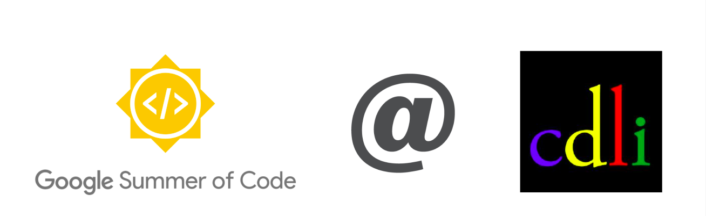
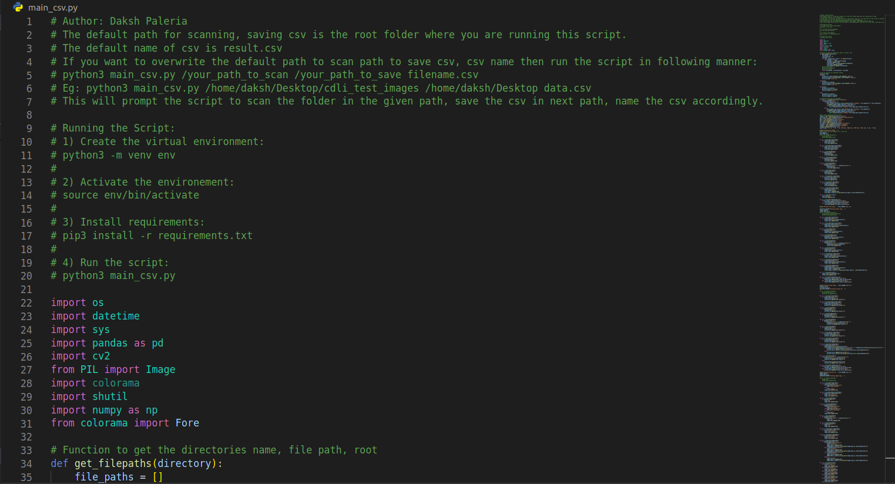
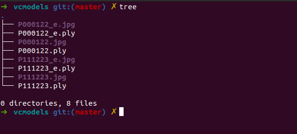
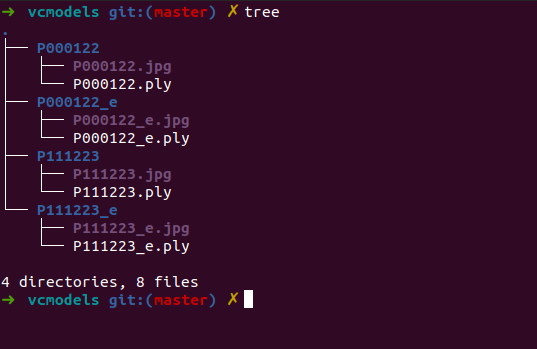
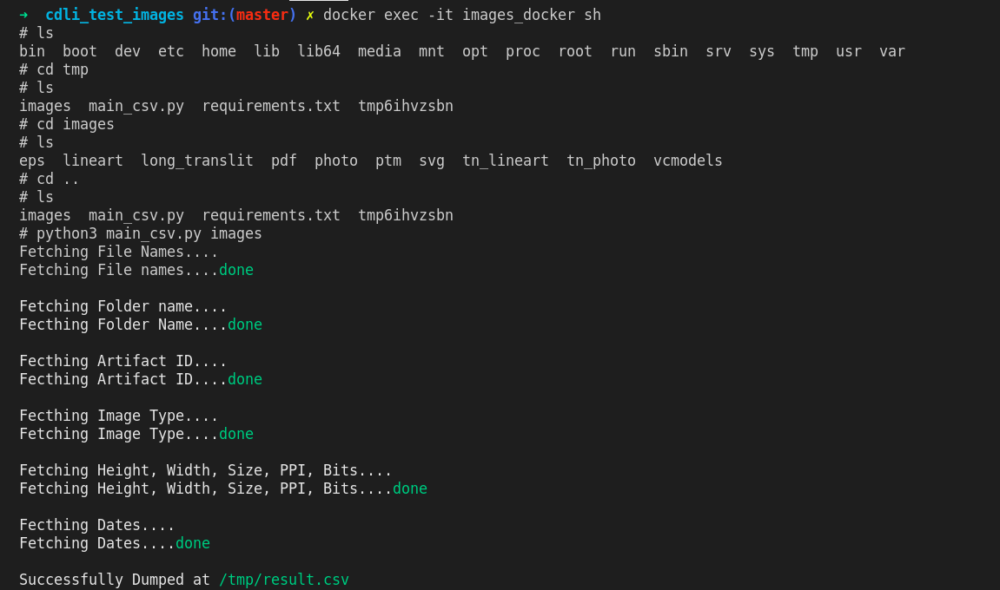
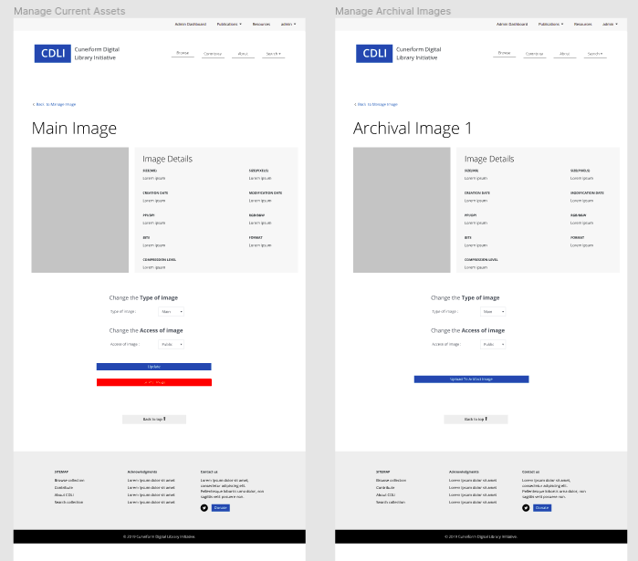
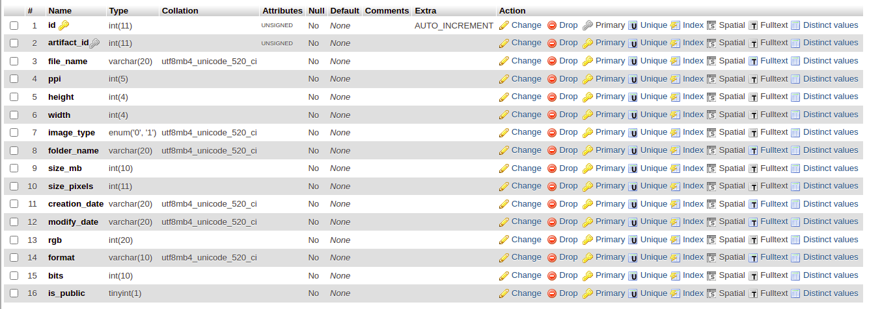
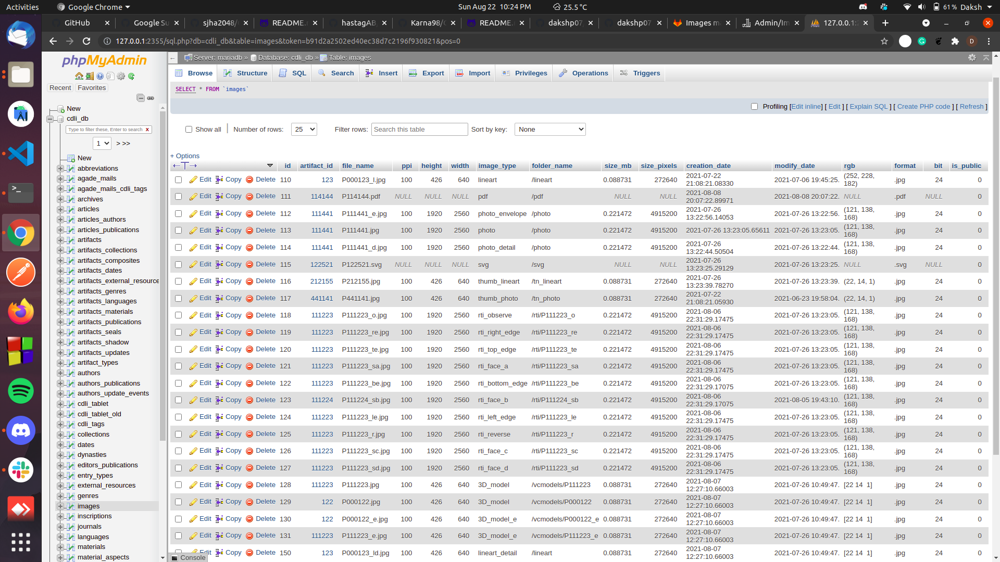

<h1 align="center">Google Summer of Code 2021</h1>

<i>with</i>

<h2 align="center"><a href="https://summerofcode.withgoogle.com/organizations/5003360748437504/">Cuneiform Digital Library Initiative (CDLI)</a></h2>

<h2>Digital Library Management @ <a href="https://github.com/cdli-gh/">CDLI</a></h2>

<a href="#project-details">Project Details </a>|
<a href="#links">Links </a>|
<a href="#team">Team </a>|
<a href="#objectives-accomplished">Objectives Accomplished </a>|
<a href="#deliverables">Deliverables </a>|
<a href="#contributions">Contribution </a>|
<a href="#post-gsoc">Post GSoC </a>|
<a href="#acknowledgment">Acknowledgement </a>

Check out my <a href="https://cdli-gh.github.io/blog/gsoc21/digitalLibraryManagement/index">blog</a> or follow me on <a href="https://twitter.com/dakshp07">Twitter</a> for more updates.

## Project Details
Digital Library Management is about preparing a dashboard that can show an admin the visual assets of the digital library for each artifact but also add, edit, delete, images using our archival images serve as a source of better quality images to prepare their web counterpart. Access to images should also be managed there (some images are not public).

### Objectives

#### Primary

Develop a dashboard and a series of workflows so admins can manage the digital library (dl)
Populate the tables with information from the current dl
Keep the system flexible so we can create an extension for crowdsourcing of images in the future

#### Secondary

Assist in setting up an automated grab of archival and raw images from the VM, to the archival server. These images will have been uploaded through the images manager or the minio interface.
Set up a granular access to images at the image level (instead of at the artifact level)
Operations handled by the images manager

- Create web version of images for an artifact using the archival version
- Change the type for an image (main, detail, envelope, lineart, lineart detail, etc)
- Associate existing images with a different artifact (when an error was made)
- Associate images with artifacts, images which are currently associated with no artifact
- Overview of assets for one artifact
- Overview of assets for all artifacts (stats, also per collection)
- Granular access for images management

## Links
- [Proposal](https://docs.google.com/document/d/1_B54MqUZHQOMm2iRRvYYVMqDiDcIz5tq9iY6Qm7fvnw/edit?usp=sharing)
- [Weekly Blogs](https://cdli-gh.github.io/blog/gsoc21/digitalLibraryManagement/index)
- [Repository](https://gitlab.com/cdli/framework)

## Team
- [Daksh Paleria](https://github.com/dakshp07) - Mentee
- [Jacob L. Dahl](mailto:jacob.dahl@orinst.ox.ac.uk) - Mentor
- [Émilie Pagé-Perron](https://github.com/epageperron) - Mentor

## Tech Stack
- CakePHP 4
- Python
- Docker
- HTML

## Objectives Accomplished

1. ### Python Script For Dumping Information
   - A python script for web images, archival images.
   - Scanning the folders, files and dumping them into CSV.
   - Make folders for specific type of assets.

    

    
    | **Script** |
    | :----: |
    | |
    | The python script with the instructions to run mentioned on top. |

    

    - The script should handle the creation of folder for `VCModels/3D Models` on the basis of the file name.
    - In 3D Model folder we have two (in some cases more) files for every artifact. One is `.ply` model and the other is its `.jpg` image.
    - I was supposed to handle creation of a folder for every artifact with all the entities related to it inside the folder.

    

    
    | **Structure Before Running Script** |
    | :----: |
    | |
    | You can see all the entities inside one folder ie VCModels |

    

    - Once the script runs it scans through VCModels and makes folder on the basis of file name.

    

    | **Structure After Running Script** |
    | :----: |
    | |
    | You can see all the entities inside their own specific folder under the parent folder of VCModels |

    

    - Once the scanning is done we pick up all our necessary information and dump them inside an CSV.

    

    | **Resulting CSV** |
    | :----: |
    | |
    | These are the few information we are scanning for our requirements. |

    

    
    - Since there were issues in python version which then in turn interferes with versions of libraries being used.
    - We dockerized the complete script so that it can run inside a docker container, the admins can go inside the containers and access the stuff needed.

    

    | **Script Inside the Container** |
    | :----: |
    | |
    | Running a few `sh` commands can take the admins inside the container where they can run the script, navigate through the folders accordingly. |

    

    - You can see the complete script [here](https://github.com/dakshp07/python-docker-script).

    

    | **Complete Script** |
    | :----: |
    | |
    | The complete script in action. |

    

    - We have a similar script for archival images which just has a few changed regarding the folder structure of the assets.

    

    | **Complete Script Inside Docker Container** |
    | :----: |
    | |
    | The complete script in action inside the docker container. |

    

2. ### Designing Different Pages for Project
   - The next important task was to design the pages required by the project.
   - The most challenging part was to keep the design user friendly (as most of people uing my projects are research scholars).
   - I have reused most of the existing elements from the current design.

    

    | **Home Screens for Single View** |
    | :----: |
    | |
    | The complete script in action inside the docker container. |

    

    - The complete design file can be accessed from [here](https://www.figma.com/file/jOKep53xdWK6YS6Xqtqoef/CDLI-GSoC-Design?node-id=0%3A1).

3. ### Images Table in DB
   - It was time to decide upon the strcuture of the images table.
   - The users would require a few specifics in order to make a decision for one specific file.

   

    | **Images Table** |
    | :----: |
    | |
    | The structure of images table we decided upon. |

    

    - Since the server which stored all the web images was facing a few issues we decided to fill the table with a few test images and start working upon the backend and frontend of the project.

    

    | **Images Table** |
    | :----: |
    | |
    | The images table filled with a few test data. |

    

4. ### Creating the Frontend 
   - I was supposed to work on the frontend and make the templates for the project.
   - The main page was the index, the second page is list of all visual asset related to one artifact.
   - The third page is where the admins can edit, delete the images.

    

    | **Walkthrough for Frontend** |
    | :----: |
    | |
    | The complete fronted of the project. |

    

    - The design team helped a lot in finalizing the designs, tons of discussions with Jacob resulted into this design.

5. ### Working on Backend
   - The next task was to integrate the functionalities of backend into frontend.
   - We wanted to restrict this project just to the admins and not to the normal users.

    

    | **Admin Access** |
    | :----: |
    | |
    | Only admins, super-admins are able to access the functionalities provided by project. |

    

    - The other functionality we were trying to provide is to view all the visual assets related to an specific artifact.

    

    | **View for Single Artifact** |
    | :----: |
    | |
    | Displaying all the visual assets related to one specific artifact. |

    

    - Single View for one visual asset was the other task.
    - Since the visual asset could be of type jpg (image), pdf, ply (models) we were supposed to display them to the users in order to make a decision.

    

    | **Handling Different Types of Files** |
    | :----: |
    | |
    | Handling different types of files (pdf, svg, etc). |

    

    - The next functionality was to change the type of visual asset, change its access level.
    - We have around 25 types of visual asset and the admin has the access to change its type, change its access level (public or private).

    

    | **Manage Type of Visual Asset** |
    | :----: |
    | |
    | Changing the type of visual asset. |

    

    - While changing the visual assets there will be a case where the visual asset of other type already exists.
    - At such situations the admins should be able to able to overwrite the existing visual asset with the one they are changing.

    

    | **Renaming Asset, Removing Duplicate Entries** |
    | :----: |
    | |
    | Changing the type of visual asset. |

    

## Deliverables
### What Was Done
During these three months I have completed all the essential objectives which includes

| \# | Objectives | PR/Commit/Link | Associated Deliverables | Status |
|----|-------------|----------------|---------|--------|
| 1 | Design Pages   | [Link](https://www.figma.com/file/jOKep53xdWK6YS6Xqtqoef/CDLI-GSoC-Design?node-id=0%3A1) | Design the pages for viewing archival images, selecting multiple artifacts at a time, upload archival images [#609](https://gitlab.com/cdli/framework/-/issues/609) | Completed  |
| 2 | Prepare Images Table  |  [Link](https://gitlab.com/cdli/framework/-/issues/87#note_602032029)  | Storing information regarding images in our table  [#87](https://gitlab.com/cdli/framework/-/issues/87) |Completed |
| 3  |  Work Around Web Images   |  [!355](https://gitlab.com/cdli/framework/-/merge_requests/355), [!377](https://gitlab.com/cdli/framework/-/merge_requests/377/)  | Allowing the admins to work around the web images by giving them the option to add, edit, delete  [#87](https://gitlab.com/cdli/framework/-/issues/87) |Completed   |
| 4  |  Python Script | --  |  A python script to extarct information and dump them in CSV. [#87](https://gitlab.com/cdli/framework/-/issues/87) | Completed |
| 5  | Testing Functionalities | -- | Testing fucntionalities of the web images. | Completed |

### Objectives

:heavy_check_mark: --> Completed Tasks
:white_check_mark: --> Ongoing Tasks

| \# | Status  | Objectives                    | Associated Deliverables         | issue(s) |
| --- | --- | ----------------------------- | ---------------------------------------------- | -------- |
| 1 | :heavy_check_mark: | Design Pages | Design the pages for viewing archival images, selecting multiple artifacts at a time, upload archival images | [#609](https://gitlab.com/cdli/framework/-/issues/609) |
| 2 | :heavy_check_mark: | Prepare Image Table | Storing information regarding images in our table | [#87](https://gitlab.com/cdli/framework/-/issues/87) |
| 3 | :heavy_check_mark: | Work Around Web Images | Allowing the admins to work around the web images by giving them the option to add, edit, delete | [#87](https://gitlab.com/cdli/framework/-/issues/87) |
| 4 | :heavy_check_mark: | Python Script to store details | A python script to extarct information and dump them in CSV. | [#87](https://gitlab.com/cdli/framework/-/issues/87) |
| 5 | :white_check_mark: | Dealing with Archival Images | Adding the functionality to convert, view and peform operations on  archival images. | [#87](https://gitlab.com/cdli/framework/-/issues/87) |  

## Contributions
- [Merge Requests](https://gitlab.com/cdli/framework/-/merge_requests?scope=all&state=all&author_username=dakshp07)
- [Issues](https://gitlab.com/cdli/framework/-/issues?scope=all&state=all&author_username=dakshp07)

## Post GSoC 
- Dealing with arcival images is the task which is now on my to-do list.
- We have to work around the conversion algorithm which can help us in displaying the images to admin on the framework and then allow them to make changes on it.

## Acknowledgment
- I would like to thank my mentor Jacob L. Dahl & Émilie Pagé-Perron for helping and guiding throughout the GSoC Journey :)
- Thanks to other mentees and mentors for collaboration.
- I am thankful to Google Summer Of Code for providing me with an opportunity to work with CDLI.